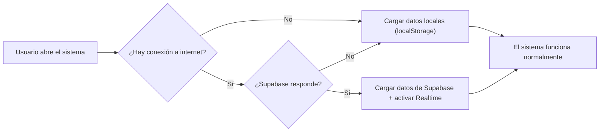
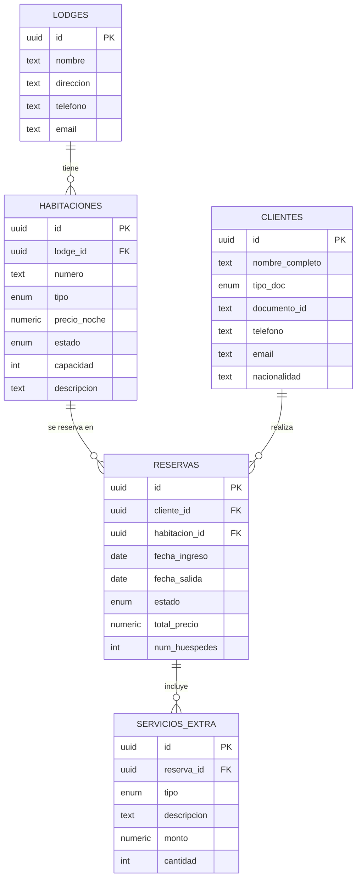

# 📋 DOCUMENTO DE PRIMER AVANCE — SelvaStay Pro

## Sistema de Gestión Operativa para Eco-Lodges y Negocios de Reservas

**Curso:** Gestión de Proyectos  
**Ciclo:** VII  
**Fecha de Entrega:** Mayo 2026  
**Versión:** 2.5.0  
**Estado:** Primer Avance — MVP Funcional  

---

## 1. DESCRIPCIÓN GENERAL DEL PROYECTO

**SelvaStay Pro** es un sistema web de gestión operativa diseñado para eco-lodges, hoteles, y negocios de reservas ubicados en la región San Martín, Perú. El sistema permite administrar habitaciones, reservas, clientes, servicios adicionales, y proyectos internos del negocio desde una interfaz unificada.

### Problema Identificado
Los eco-lodges y recreos turísticos de la selva peruana gestionan sus operaciones de forma manual (cuadernos, hojas de Excel), lo que provoca:
- Overbooking por falta de control de disponibilidad en tiempo real
- Pérdida de información de huéspedes
- Ausencia de trazabilidad en las operaciones
- Dificultad para coordinar proyectos internos de mejora

### Solución Propuesta
Un sistema web moderno con las siguientes características clave:
- **Offline-First:** Funciona sin internet usando datos locales (localStorage)
- **Sincronización en Tiempo Real:** Cuando hay conexión, se sincroniza automáticamente con Supabase (PostgreSQL en la nube)
- **100% Personalizable:** Adaptable a cualquier tipo de negocio (hotel, coworking, canchas deportivas, alquiler de vehículos)
- **Módulo de Gestión de Proyectos:** Integración de metodología Scrum/Kanban para la gestión interna

---

## 2. EXPLICACIÓN DE CADA APARTADO DEL SISTEMA

### 2.1 🔐 Pantalla de Login (Inicio de Sesión)

**¿Para qué sirve?**  
Es la puerta de entrada al sistema. Controla el acceso para que solo personal autorizado pueda ver y modificar la información operativa del negocio.

**Características:**
- Formulario de email y contraseña con validación
- Diseño minimalista con la identidad visual de SelvaStay
- Botón de "¿Olvidaste tu contraseña?" para recuperación
- Animación de carga durante la autenticación
- Redirección automática al Dashboard tras iniciar sesión

**Archivo principal:** `src/pages/LoginPage.jsx`

---

### 2.2 📊 Dashboard (Panel Principal)

**¿Para qué sirve?**  
Es el centro de control del negocio. En una sola vista muestra el estado actual de todas las operaciones: cuántas habitaciones están disponibles, ocupadas, en reserva, y los ingresos del día.

**Componentes del Dashboard:**

| Sección | Función |
|---------|---------|
| **Tarjetas de Estadísticas (KPIs)** | 4 indicadores: Disponibles, En Uso, Reservas, % Ocupación |
| **Barra de Distribución** | Visualización porcentual del estado de todas las habitaciones |
| **Vista Operativa (Mapa/Grid)** | Dos modos de visualización: Mapa Isométrico interactivo o Grilla de tarjetas |
| **Tarjeta de Ingresos** | Muestra el ingreso estimado del día actual |
| **Widget de Clima** | Clima en tiempo real de Tarapoto (API OpenWeatherMap) |
| **Actividad Reciente** | Resumen rápido del estado operativo |
| **Check-in QR** | Generador de código QR para check-in desde el celular del huésped |

**Archivo principal:** `src/pages/DashboardPage.jsx`

---

### 2.3 🗺️ Mapa Interactivo (LodgeMap)

**¿Para qué sirve?**  
Muestra una representación visual isométrica (3D simplificada) de todas las habitaciones del lodge. Permite ver de un vistazo qué habitaciones están libres, ocupadas, en reserva, o en mantenimiento.

**Funcionalidades:**
- **Arrastrar con el mouse** para navegar por el plano
- **Zoom con rueda del mouse** o con botones (+/-)
- **Botón de resetear vista** para volver a la posición original
- **Click en cualquier habitación** para ver su estado y realizar acciones (check-in, check-out)
- **Código de colores:**
  - 🟢 Verde = Disponible
  - 🔵 Azul = Reservada
  - 🟠 Ámbar = Ocupada
  - 🔴 Rojo = Mantenimiento
  - 🟣 Púrpura = En limpieza
- **Panel de información** al pasar el mouse sobre una habitación (número, tipo, estado, huésped actual)

> **Justificación técnica:** Se usa `useState` para el estado del pan (posición X/Y) y zoom (escala). Los eventos `onMouseDown/Move/Up` manejan el arrastre. Es un patrón estándar en interfaces interactivas que no requiere librerías externas.

**Archivo principal:** `src/components/LodgeMap.jsx`

---

### 2.4 📅 Reservas

**¿Para qué sirve?**  
Gestiona todo el ciclo de vida de una reserva: desde la solicitud hasta el checkout. Permite crear, confirmar, hacer check-in, check-out, y cancelar reservas.

**Flujo de una reserva:**
```
Pendiente → Confirmada → Check-in → Check-out
                                  → Cancelada
```

**Campos que maneja:**
- Cliente (vinculado al directorio de huéspedes)
- Habitación asignada
- Fecha de ingreso y salida
- Número de huéspedes
- Total a cobrar (calculado automáticamente)
- Estado actual de la reserva

**Archivo principal:** `src/pages/ReservasPage.jsx`

---

### 2.5 👥 Clientes / Huéspedes

**¿Para qué sirve?**  
Es el directorio de todos los huéspedes que se han hospedado o tienen reservas. Permite buscar, filtrar, y ver el historial de cada cliente.

**Datos almacenados:**
- Nombre completo
- Tipo de documento (DNI, Pasaporte, CE, RUC)
- Número de documento
- Teléfono y email de contacto
- Nacionalidad
- Notas internas

**Archivo principal:** `src/pages/ClientesPage.jsx`

---

### 2.6 🍽️ Servicios Extra

**¿Para qué sirve?**  
Registra los consumos y servicios adicionales que solicitan los huéspedes durante su estadía: restaurante, tours, spa, transporte, lavandería, etc.

**Tipos de servicios:**
| Tipo | Ejemplo |
|------|---------|
| Restaurante | Cena amazónica para 2 personas |
| Tour | Cataratas de Ahuashiyacu |
| Spa | Masaje relajante de 60 minutos |
| Transporte | Traslado aeropuerto - lodge |
| Lavandería | Lavado y planchado express |

**Archivo principal:** `src/pages/ServiciosPage.jsx`

---

### 2.7 📋 Gestión de Proyectos Internos (Scrum/Kanban)

**¿Para qué sirve?**  
Implementa la metodología ágil Scrum/Kanban para la gestión de proyectos internos del negocio. Permite planificar tareas de mantenimiento, marketing, digitalización, etc.

> **Relación con el curso:** Este módulo aplica directamente los conceptos de:
> - **Sprints:** Periodos de trabajo de 2 semanas con tareas definidas
> - **Tablero Kanban:** Columnas de Backlog → Planificación → Ejecución → Completado
> - **Cronograma Gantt:** Vista temporal con barras de progreso por tarea
> - **KPIs del Sprint:** Total de tareas, activas, críticas, % de avance
> - **Trazabilidad:** Cada movimiento de tarea queda registrado en la bitácora

**Vistas disponibles:**
1. **Kanban Board:** 4 columnas con tarjetas arrastrables (Backlog, Planificación, Ejecución, Completado)
2. **Cronograma Gantt:** Vista de línea temporal con barras de progreso

**Datos de cada tarea:**
- Título y descripción detallada
- Prioridad (Alta/Media/Baja) con código de color
- Responsable asignado
- Fecha de inicio y cierre
- Porcentaje de progreso
- Sprint al que pertenece

**Archivo principal:** `src/pages/ProyectosPage.jsx`

---

### 2.8 ⚙️ Ajustes y Personalización

**¿Para qué sirve?**  
Permite adaptar el sistema a cualquier tipo de negocio. Desde aquí se configura el nombre del negocio, la moneda, el tipo de negocio, y qué módulos están activos.

**Funcionalidades:**

| Sección | Función |
|---------|---------|
| **Sincronización** | Muestra el estado de conexión a internet y a Supabase |
| **Tecnología** | Versión del software, tipo de persistencia, capacidad offline |
| **Configuración de Adaptabilidad** | Nombre del negocio, moneda (S/, $, €), tipo de negocio |
| **Selector de Giro** | 5 tipos: Eco-Lodge, Hotel, Coworking, Canchas, Alquiler |
| **Módulos Habilitados** | Activar/desactivar Clientes, Servicios, Proyectos |
| **Bitácora de Auditoría** | Historial de todas las acciones realizadas en el sistema |

**Motor de Adaptabilidad:** Al cambiar el tipo de negocio, el sistema cambia automáticamente la terminología:
- Lodge: Habitación → Huésped → Reserva
- Hotel: Habitación → Huésped → Reserva  
- Coworking: Escritorio/Sala → Miembro → Reservación
- Canchas: Cancha → Jugador → Turno
- Alquiler: Vehículo/Equipo → Cliente → Alquiler

**Archivo principal:** `src/pages/ConfigPage.jsx`

---

### 2.9 📝 Bitácora de Auditoría y Trazabilidad

**¿Para qué sirve?**  
Registra cronológicamente cada acción importante realizada en el sistema (creación de tareas, movimientos en el Kanban, cambios de configuración, etc.). Esto es fundamental para:
- **Control de calidad** (ISO 25010)
- **Rendición de cuentas** del equipo
- **Historial de cambios** para auditorías internas
- **Exportación a JSON** para documentación

> **Relación con el curso:** La trazabilidad es un pilar de la gestión de proyectos porque permite rastrear quién hizo qué, cuándo, y por qué.

---

## 3. ARQUITECTURA TÉCNICA

### 3.1 Stack Tecnológico

| Tecnología | Rol | Justificación |
|-----------|-----|---------------|
| **React 19** | Frontend (interfaz) | Librería líder para crear interfaces interactivas con componentes reutilizables |
| **Vite** | Build Tool | Compilador rápido para desarrollo moderno, reemplaza a Webpack por su velocidad |
| **Tailwind CSS 4** | Estilos | Framework de CSS utilitario que permite diseñar directamente en el HTML |
| **Supabase** | Backend / Base de datos | PostgreSQL en la nube con API automática y sincronización en tiempo real |
| **Lucide React** | Iconografía | Librería de iconos SVG ligera y profesional |
| **React Router** | Navegación | Manejo de rutas/páginas sin recargar el navegador (SPA) |
| **React Hot Toast** | Notificaciones | Mensajes emergentes elegantes para confirmar acciones |
| **QRCode.react** | Códigos QR | Generación de QR para check-in desde el celular |

### 3.2 Arquitectura del Proyecto

```
SELVASTAY PRO/
├── src/
│   ├── components/     ← Componentes reutilizables (Sidebar, LodgeMap, etc.)
│   ├── pages/          ← Páginas principales (Dashboard, Reservas, etc.)
│   ├── hooks/          ← Lógica de negocio (useHabitaciones, useReservas, etc.)
│   ├── lib/            ← Configuración (Supabase, datos demo)
│   ├── config/         ← Configuraciones de API
│   ├── App.jsx         ← Router principal
│   ├── main.jsx        ← Punto de entrada
│   └── index.css       ← Sistema de diseño global
├── supabase/
│   └── migrations/     ← Scripts SQL de la base de datos
├── backend/            ← Servidor Express (rutas API adicionales)
└── package.json        ← Dependencias del proyecto
```

### 3.3 Patrón Offline-First



---

## 4. BASE DE DATOS (Supabase / PostgreSQL)

### 4.1 Diagrama Entidad-Relación



### 4.2 Datos de Prueba Cargados

**Lodge registrado:**
- SelvaStay Tarapoto — Km 12 Carretera a Lamas, San Martín

**17 Habitaciones** distribuidas en:
- 4 simples (101-102, 105, 107)
- 4 dobles (103-104, 106, 204)
- 3 suites (201-203)
- 2 cabañas (C-01, C-02)
- 1 bungalow (B-01)
- 2 glamping (G-01, G-02)

**8 Clientes** registrados:
- 5 peruanos con DNI
- 3 extranjeros con pasaporte (Francia, EEUU, Alemania)

**8 Reservas** en diferentes estados:
- 5 con check-in activo (huéspedes hospedados)
- 2 confirmadas (llegarán próximamente)
- 1 con checkout completado

**9 Servicios Extra** facturados:
- Restaurante, tours, spa, transporte, lavandería

---

## 5. TEMAS DE GESTIÓN DE PROYECTOS APLICADOS

| Tema del Curso | Cómo se Aplica en SelvaStay Pro |
|---------------|-------------------------------|
| **Definición de Alcance** | El sistema tiene módulos claramente delimitados con funcionalidades específicas |
| **EDT (Estructura de Desglose)** | Los sprints desglosan el trabajo en tareas atómicas con responsables |
| **Metodología Ágil (Scrum)** | Sprints de 2 semanas, tablero Kanban con 4 columnas |
| **Cronograma (Gantt)** | Vista de cronograma con barras de progreso por tarea |
| **Gestión de Riesgos** | Modo offline-first mitiga el riesgo de falta de conectividad |
| **Control de Calidad** | Bitácora de auditoría con trazabilidad ISO 25010 |
| **Gestión del Cambio** | Configuración adaptable que permite cambiar el tipo de negocio |
| **KPIs y Métricas** | Dashboard con indicadores de ocupación, ingresos, y progreso de sprints |
| **Gestión de Stakeholders** | El sistema diferencia roles (administrador, recepcionista) |
| **Documentación** | Este documento y la bitácora exportable a JSON |

---

## 6. GUIÓN DE PRESENTACIÓN (10-15 minutos)

### Minuto 0-2: Contexto
> "Buenas tardes, les presentamos SelvaStay Pro, un sistema de gestión operativa diseñado para eco-lodges y negocios de reservas en San Martín. El problema que resolvemos es que estos negocios manejan sus operaciones de forma manual, lo que genera overbooking, pérdida de datos, y falta de trazabilidad."

### Minuto 2-4: Demo del Login y Dashboard
> "Al ingresar al sistema, llegamos al Dashboard principal. Aquí vemos en tiempo real: X habitaciones disponibles, Y ocupadas, Z reservadas, y un porcentaje de ocupación del N%. También tenemos el ingreso estimado del día y un widget con el clima actual de Tarapoto."

### Minuto 4-6: Demo del Mapa Interactivo
> "Una de las funcionalidades destacadas es el mapa interactivo. Podemos arrastrar con el mouse para navegar, hacer zoom con la rueda, y al hacer click en cualquier habitación vemos su estado completo y podemos hacer check-in o check-out directamente."

### Minuto 6-8: Demo de Reservas y Clientes
> "El módulo de reservas gestiona todo el ciclo: desde que el huésped confirma hasta el checkout. Los datos del huésped se almacenan automáticamente en el directorio de clientes, incluyendo su tipo de documento, nacionalidad, y datos de contacto."

### Minuto 8-10: Demo de Gestión de Proyectos (Kanban/Gantt)
> "Aquí es donde aplicamos la metodología ágil del curso. Tenemos 3 sprints configurados con tareas reales: mantenimiento de infraestructura, campaña de marketing, y digitalización de procesos. El tablero Kanban permite mover tareas entre columnas, y la vista Gantt muestra el cronograma de ejecución."

### Minuto 10-12: Demo de Configuración y Adaptabilidad
> "El sistema es 100% personalizable. Podemos cambiar el nombre del negocio, la moneda, y el tipo de negocio. Si lo cambiamos a 'Coworking', el sistema adapta toda la terminología: 'Habitaciones' pasa a ser 'Escritorios', 'Huéspedes' pasa a ser 'Miembros'. Esto lo hace reutilizable para cualquier negocio."

### Minuto 12-14: Bitácora de Auditoría y Tecnología
> "Cada acción queda registrada en la bitácora de auditoría, que se puede exportar a JSON para documentación. El sistema usa React, Supabase como base de datos, y funciona tanto online como offline. Está desplegado en Vercel y se actualiza automáticamente con cada push a GitHub."

### Minuto 14-15: Cierre y Preguntas
> "En resumen, SelvaStay Pro es un MVP funcional que demuestra la aplicación práctica de la gestión de proyectos en un sistema real. Para el siguiente avance, planeamos integrar reportes avanzados, autenticación con roles, y notificaciones push. ¿Alguna pregunta?"

---

## 7. ESTADO DEL PRIMER AVANCE

### ✅ Completado
- [x] Dashboard funcional con KPIs en tiempo real
- [x] Mapa interactivo arrastrable con zoom
- [x] Módulo de reservas con flujo completo
- [x] Directorio de clientes con búsqueda
- [x] Registro de servicios extra
- [x] Módulo de proyectos con Kanban y Gantt
- [x] Configuración adaptable a múltiples negocios
- [x] Bitácora de auditoría exportable
- [x] Widget de clima en tiempo real
- [x] Check-in por QR
- [x] Modo offline-first
- [x] Conexión a Supabase con realtime
- [x] Despliegue en Vercel (producción)
- [x] Datos de prueba realistas cargados

### 🔜 Próximo Avance
- [ ] Autenticación real con Supabase Auth (roles: admin, recepcionista)
- [ ] Reportes PDF de ocupación y facturación
- [ ] Notificaciones push para check-in/check-out
- [ ] Módulo de facturación y cobros
- [ ] Tests unitarios y de integración

---

## 8. ACCESOS Y ENLACES

| Recurso | Enlace |
|---------|--------|
| **Producción (Vercel)** | *Se proporcionará en la presentación* |
| **Repositorio GitHub** | github.com/Kopozz/SELVASTAY |
| **Base de Datos (Supabase)** | Panel de administración en supabase.com |

---

> **Nota:** Este documento fue elaborado como parte del primer avance del curso de Gestión de Proyectos, VII ciclo de Ingeniería de Sistemas.
