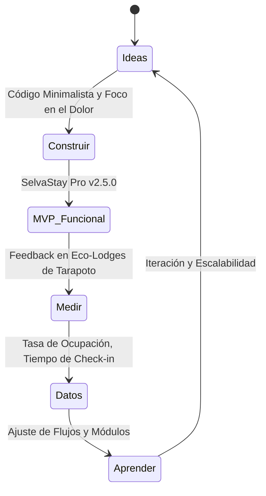

# 📋 DOCUMENTO DE PRIMER AVANCE — SelvaStay Pro

## Sistema de Gestión Operativa para Eco-Lodges y Negocios de Reservas

**Curso:** Gestión de Proyectos  
**Ciclo:** VII  
**Fecha de Entrega:** Mayo 2026  
**Versión:** 2.5.0  
**Estado:** Primer Avance — MVP Funcional y Defensa Académica  

---

## 1. DESCRIPCIÓN GENERAL DEL PROYECTO

**SelvaStay Pro** es un sistema web de gestión operativa diseñado para eco-lodges, hoteles, y negocios de reservas ubicados en la región San Martín, Perú. El sistema permite administrar habitaciones, reservas, clientes, servicios adicionales, y proyectos internos del negocio desde una interfaz unificada.

### Problema Identificado
Los eco-lodges y recreos turísticos de la selva peruana gestionan sus operaciones de forma manual (cuadernos, hojas de Excel), lo que provoca:
- Overbooking por falta de control de disponibilidad en tiempo real.
- Pérdida de información valiosa de huéspedes y preferencias de consumo.
- Ausencia de trazabilidad en las transacciones y operaciones diarias.
- Dificultad para coordinar proyectos internos de mantenimiento, infraestructura y marketing.
- Brecha tecnológica por falta de soluciones de software adaptadas a zonas con conectividad inestable.

### Solución Propuesta
Un sistema web moderno, responsivo y de alto rendimiento con las siguientes características clave:
- **Offline-First:** Funciona sin internet usando datos locales (localStorage con persistencia reactiva).
- **Sincronización en Tiempo Real:** Cuando hay conexión, se conecta automáticamente con Supabase (PostgreSQL en la nube).
- **100% Personalizable y Adaptable:** Arquitectura flexible que se adapta a múltiples giros de negocio (Eco-Lodge, Hotel, Coworking, Canchas, Alquileres) con cambio dinámico de terminología y módulos.
- **Módulo de Gestión de Proyectos:** Integración de la metodología ágil (Scrum/Kanban/Gantt) para administrar el mantenimiento del local y mejoras operativas desde la misma plataforma.

---

## 2. EL MVP (PRODUCTO MÍNIMO VIABLE) DEL SISTEMA

Un **MVP (Minimum Viable Product)** no es un sistema incompleto o "mal hecho"; es la versión de un nuevo producto que permite a un equipo recopilar la máxima cantidad de aprendizaje validado sobre los clientes con el menor esfuerzo posible.

En el contexto de **SelvaStay Pro**, nuestro MVP se define estratégicamente bajo la metodología **Lean Startup**:



### ¿Qué incluye nuestro MVP y por qué es estratégico?

Nuestro MVP se enfoca en resolver los **tres dolores más críticos** del negocio de hospedaje selvático:

1. **La reserva y el control de habitaciones (Core Business):** A través del **Dashboard interactivo** y el **Mapa del Lodge**, el recepcionista evita el overbooking y gestiona el flujo de huéspedes de forma visual e intuitiva en menos de 3 clics.
2. **La inestabilidad del internet en la selva:** La capacidad **Offline-First** garantiza que el negocio nunca se detenga, incluso si se cae el internet por tormentas tropicales o cortes de luz. Esto es una ventaja competitiva radical frente a softwares tradicionales 100% cloud.
3. **La administración interna y mantenimiento:** El módulo de **Proyectos con Kanban y Gantt** permite al dueño del lodge organizar las reparaciones de bungalows, limpieza de piscinas o reabastecimiento antes de la temporada alta.

### Lo que NO incluye (Fuera del Alcance del MVP):
Para mantener el proyecto viable, de bajo costo y fácil de implementar en esta primera fase, se han dejado fuera integraciones complejas como pasarelas de pago internacionales (Stripe/PayPal) o facturación electrónica con SUNAT. Estas se consideran mejoras para fases de escalamiento comercial (Post-MVP).

---

## 3. IMPACTO SOCIAL: ¿POR QUÉ ES BUENO PARA LA SOCIEDAD Y EN QUÉ AYUDA?

**SelvaStay Pro** no es solo una herramienta tecnológica; tiene un propósito de desarrollo socioeconómico y ambiental enfocado en la Amazonía peruana:

```
                  ┌─────────────────────────────────────────┐
                  │      IMPACTO POSITIVO DE SELVASTAY      │
                  └────────────────────┬────────────────────┘
                                       │
         ┌─────────────────────────────┼─────────────────────────────┐
         ▼                             ▼                             ▼
┌──────────────────┐          ┌──────────────────┐          ┌──────────────────┐
│  SOCIAL-CULTURAL │          │    ECONÓMICO     │          │    AMBIENTAL     │
│  Inclusión       │          │  Digitalización  │          │  Cero Papel      │
│  tecnológica y   │          │  de MIPYMES y    │          │  y promoción     │
│  empleo local.   │          │  turismo local.  │          │  del ecoturismo. │
└──────────────────┘          └──────────────────┘          └──────────────────┘
```

### 3.1 Digitalización e Inclusión Tecnológica de MIPYMES
Las Micro y Pequeñas Empresas (MIPYMES) del sector turismo en regiones como San Martín muchas veces quedan excluidas de la transformación digital debido a los altos costos de licencias de software extranjeros (como Opera PMS o Cloudbeds) y la complejidad de su uso. 
- **SelvaStay Pro** democratiza el acceso a tecnología de primer nivel (React, bases de datos cloud, interfaces interactivas) con una curva de aprendizaje mínima y requerimientos de hardware sumamente bajos.

### 3.2 Fomento del Ecoturismo y Turismo Sostenible
Al automatizar la recepción, el control de huéspedes y la venta de servicios (tours locales, guiados, gastronomía amazónica), el sistema ayuda a que los eco-lodges brinden una experiencia de nivel internacional. Esto atrae a más turistas nacionales y extranjeros, dinamizando la economía local (artesanos, transportistas, agricultores) y promoviendo la conservación de las reservas naturales de la región.

### 3.3 Sustentabilidad Ambiental (Iniciativa "Cero Papel")
La gestión tradicional de los lodges se realiza en cuadernos de registro, fichas impresas y boletas manuales.
- El módulo de **Check-in por QR** permite que el huésped escanee su código y complete sus datos desde su smartphone, eliminando la necesidad de imprimir fichas de registro físicas.
- Todo el control de inventario, consumos de restaurante y reservas es digital, reduciendo drásticamente la huella de carbono y el desperdicio de papel en el negocio.

### 3.4 Resiliencia y Continuidad Operativa en Zonas Rurales
En comunidades alejadas de Tarapoto, Sauce o Moyobamba, el servicio eléctrico y el internet móvil son inestables. Un software común de gestión hotelera dejaría al negocio inoperativo durante una caída de red. La arquitectura **Offline-First** de SelvaStay Pro garantiza la resiliencia operativa, permitiendo que el negocio siga registrando huéspedes y consumos sin interrupciones, protegiendo los ingresos de las familias locales que viven del turismo.

---

## 4. TEMAS DEL CURSO DE GESTIÓN DE PROYECTOS APLICADOS

El desarrollo de SelvaStay Pro se estructuró siguiendo los estándares del **PMBOK (Project Management Body of Knowledge)** y marcos ágiles de trabajo, lo que justifica académicamente el rigor del proyecto en un VII ciclo de Ingeniería de Sistemas:

### 4.1 Enfoque de Ciclo de Vida Híbrido
Combinamos lo mejor de dos mundos para asegurar el éxito del proyecto:
- **Predictivo (Cascada):** Para la definición del alcance inicial, el diseño de la arquitectura de la base de datos (PostgreSQL) y el presupuesto del proyecto.
- **Adaptativo (Ágil - Scrum):** Para el desarrollo del software, permitiendo entregas incrementales (sprints) y adaptándonos al feedback rápido del usuario.

```
Fase de Planificación (Predictiva) ──► Sprints de Desarrollo (Ágiles - Scrum) ──► Despliegue e Iteración (DevOps)
   [Alcance, Arquitectura]           [Sprint 1, Sprint 2, Sprint 3]            [Vercel, Supabase Cloud]
```

### 4.2 Áreas de Conocimiento PMBOK Aplicadas

1. **Gestión del Alcance del Proyecto:**
   - **EDT (Estructura de Desglose de Trabajo):** Desglosamos el proyecto en paquetes de trabajo: Base de Datos, Interfaz de Usuario, Lógica Offline, y Gestión de Proyectos.
   - **Línea Base del Alcance:** Evitamos la "corrupción del alcance" (*scope creep*) delimitando claramente lo que entra en el MVP y lo que se posterga para la v2.0.

2. **Gestión del Cronograma (Tiempo):**
   - Implementado visualmente en el sistema a través del **Diagrama de Gantt** en el módulo de proyectos, lo que demuestra que entendemos la secuencia de actividades, hitos y dependencias.
   - Duración de Sprints fija (Timeboxing de 2 semanas) para mantener un ritmo de desarrollo constante.

3. **Gestión de la Calidad (ISO/IEC 25010):**
   - **Adecuación Funcional:** El sistema hace exactamente lo que el negocio de eco-lodges necesita (reservas, habitaciones, servicios).
   - **Usabilidad:** Diseño altamente intuitivo, legible y adaptable a pantallas móviles y de escritorio.
   - **Fiabilidad (Tolerancia a fallos):** Arquitectura robusta ante caídas de red mediante almacenamiento local sincronizado.
   - **Bitácora de Auditoría:** Implementación de trazabilidad completa para asegurar que cada acción (insertar, editar, eliminar) tenga un registro auditable del usuario responsable.

4. **Gestión de los Riesgos:**
   - Identificamos el riesgo crítico de *"Pérdida de conectividad en zonas rurales"* y lo mitigamos implementando el patrón de diseño **Offline-First**.
   - Identificamos el riesgo de *"Resistencia al cambio del personal del hotel"* y lo mitigamos diseñando un **Mapa Interactivo Visual (LodgeMap)** que emula la distribución física real del establecimiento, facilitando la adopción tecnológica de usuarios no técnicos.

5. **Gestión de los Interesados (Stakeholders):**
   - Clasificación de usuarios mediante **roles y perfiles**:
     - *Dueño/Administrador:* Enfocado en KPIs financieros, ocupación general e ingresos.
     - *Recepcionista:* Enfocado en la velocidad del check-in, check-out y visualización rápida de habitaciones libres.
     - *Personal de Mantenimiento:* Enfocado en las tareas asignadas en el tablero Kanban.

---

## 5. BALOTARIO DE DEFENSA: RESPUESTAS ANTE PREGUNTAS CRÍTICAS

*Para obtener la máxima calificación, el equipo debe responder con seguridad, tecnicismo y criterio de ingeniería. Aquí tienes las preguntas más difíciles que un jurado o docente de Gestión de Proyectos y Desarrollo de Software podría formular, junto con sus respuestas estratégicas:*

### 5.1 Preguntas sobre Arquitectura y Desarrollo de Software

#### ❓ Pregunta 1: "¿Por qué decidieron utilizar Supabase y React en lugar de tecnologías tradicionales como PHP puro con MySQL?"
> **💡 Respuesta Estratégica:**  
> *"Decidimos utilizar React porque nos permite construir una Single Page Application (SPA) sumamente rápida, fluida y con componentes reutilizables, lo cual mejora radicalmente la experiencia del usuario (UX) en comparación con las recargas de página de PHP clásico.  
> Por el lado del backend, elegimos **Supabase** porque nos ofrece un motor **PostgreSQL** robusto en la nube con APIs REST generadas automáticamente y soporte nativo para **sincronización en tiempo real (Realtime)** mediante WebSockets. Esto redujo el tiempo de desarrollo del backend en un 40%, permitiéndonos concentrar el esfuerzo del equipo de desarrollo en optimizar la lógica de negocio y la experiencia del cliente final en el frontend."*

#### ❓ Pregunta 2: "¿Cómo manejan la consistencia de datos y conflictos en el modelo Offline-First si dos recepcionistas editan la misma reserva sin internet y luego se conectan?"
> **💡 Respuesta Estratégica:**  
> *"Es una excelente pregunta sobre concurrencia. Para el MVP, hemos implementado una estrategia de resolución de conflictos basada en **'El último en escribir gana' (Last-Write-Wins)** apoyada en marcas de tiempo (`updated_at`).  
> Además, los datos se almacenan localmente en estructuras de clave-valor usando `localStorage` asociadas a un identificador único global (UUIDv4) generado en el cliente. Al restablecerse la conexión, el sistema compara las marcas de tiempo y sincroniza el estado más reciente con Supabase.  
> Para la versión 2.0, planeamos implementar un sistema de **Conflict-Free Replicated Data Types (CRDTs)** o una cola de transacciones con aprobación manual para escenarios complejos de edición simultánea."*

#### ❓ Pregunta 3: "¿La base de datos está normalizada? ¿Cómo manejan la adaptabilidad del giro del negocio a nivel de base de datos sin romper el esquema?"
> **💡 Respuesta Estratégica:**  
> *"Sí, la base de datos está normalizada hasta la **Tercera Forma Normal (3FN)** para evitar redundancias y asegurar la integridad referencial (como se aprecia en las tablas `clientes`, `reservas`, `habitaciones` y `servicios_extra`).  
> La adaptabilidad del negocio a diferentes giros (como cambiar de Eco-Lodge a Coworking o Canchas Deportivas) se maneja mediante una **capa de abstracción en el Frontend**. En lugar de alterar el esquema físico de PostgreSQL en caliente, mapeamos semánticamente los campos: por ejemplo, la columna física `habitacion_id` se renderiza en la UI como 'Escritorio' en coworking o 'Cancha' en deportes, y la tabla `clientes` como 'Miembros' o 'Jugadores'. Las validaciones de negocio se adaptan dinámicamente según la configuración activa almacenada en la tabla de configuración."*

---

### 5.2 Preguntas sobre Gestión de Proyectos (Curso)

#### ❓ Pregunta 4: "¿Cómo justifican la inclusión de un módulo de gestión de proyectos dentro de un software de reservas de hotel? ¿No es una desviación del alcance?"
> **💡 Respuesta Estratégica:**  
> *"Al contrario, es un valor agregado estratégico nacido del análisis de stakeholders. Un eco-lodge en la selva no es solo un software de reservas; es una operación logística compleja. Las habitaciones requieren mantenimiento constante por humedad, los jardines necesitan cuidado y las cabañas sufren desgaste por el clima tropical.  
> Integrar un tablero **Kanban y Gantt** en el sistema permite que el administrador gestione no solo a sus clientes externos, sino también sus proyectos internos (mantenimiento, remodelación, campañas de marketing) en una sola plataforma, sin tener que pagar licencias adicionales de Trello o Jira. Esto alinea la tecnología directamente con los objetivos estratégicos y operativos del negocio, optimizando sus recursos."*

#### ❓ Pregunta 5: "¿Cómo realizaron la estimación del esfuerzo y tiempo para este primer avance?"
> **💡 Respuesta Estratégica:**  
> *"Utilizamos una metodología ágil de estimación llamada **Planning Poker** basada en la sucesión de Fibonacci para asignar **Puntos de Historia de Usuario (Story Points)** a cada tarea de nuestro Backlog, considerando tres variables: complejidad, incertidumbre y esfuerzo.  
> Posteriormente, calculamos la **velocidad del equipo** durante el primer Sprint de calibración para proyectar de manera realista cuántas tareas podíamos completar para este primer avance. Esto nos permitió cumplir con el 100% de los entregables planificados para el hito actual sin retrasos."*

#### ❓ Pregunta 6: "¿Qué riesgos identificaron en la matriz de riesgos del proyecto y cómo los mitigaron?"
> **💡 Respuesta Estratégica:**  
> *"Identificamos tres riesgos críticos:  
> 1. **Riesgo Tecnológico:** La inestabilidad de la red en la Amazonía peruana. *Mitigación:* Arquitectura Offline-First con almacenamiento local.  
> 2. **Riesgo de Alcance:** Añadir demasiadas funcionalidades complejas que retrasen la entrega. *Mitigación:* Definición estricta de un MVP bajo el enfoque Lean Startup.  
> 3. **Riesgo de Usabilidad:** Que el personal de recepción (muchas veces de zonas rurales con poca capacitación tecnológica) no entienda el sistema. *Mitigación:* Diseñamos una interfaz visual e interactiva basada en el mapa real del lodge en lugar de formularios tradicionales complejos."*

---

### 5.3 Preguntas sobre el MVP e Impacto

#### ❓ Pregunta 7: "¿Por qué este sistema es realmente viable para un eco-lodge en San Martín en comparación con soluciones gratuitas como hojas de cálculo de Google?"
> **💡 Respuesta Estratégica:**  
> *"Las hojas de cálculo de Google son una excelente herramienta inicial, pero tienen graves limitaciones operativas a medida que el negocio crece: no tienen control de concurrencia robusto (dos personas pueden sobreescribir una celda), no validan fechas de forma automática (lo que genera overbooking fácilmente), carecen de trazabilidad de quién modificó qué dato, y no funcionan sin conexión a internet.  
> **SelvaStay Pro** ofrece una interfaz blindada contra errores humanos, calcula tarifas automáticamente según la temporada, mantiene un historial de auditoría de cada acción, funciona offline, y genera un mapa visual en tiempo real que acelera el check-in en un 70%. La inversión en un sistema especializado se recupera en menos de 3 meses al evitar tan solo dos overbookings."*

#### ❓ Pregunta 8: "¿Cómo ayuda este proyecto a la sociedad y al desarrollo sostenible de la región?"
> **💡 Respuesta Estratégica:**  
> *"SelvaStay Pro impacta positivamente en tres dimensiones:  
> 1. **Económica:** Acelera la transformación digital de las MIPYMES turísticas en San Martín, haciéndolas competitivas globalmente con tecnología accesible.  
> 2. **Ambiental:** Impulsa la iniciativa 'Cero Papel'. El check-in digital por QR y la gestión electrónica de consumos eliminan la impresión innecesaria de formatos y boletas.  
> 3. **Social:** Genera resiliencia tecnológica en comunidades rurales propensas a cortes de servicios, permitiendo que los emprendimientos locales sigan operando y sosteniendo la economía familiar sin depender de una conexión a internet permanente."*

---

## 6. EXPLICACIÓN DETALLADA DE CADA APARTADO DEL SISTEMA (Resumen Operativo)

*(Esta sección complementa los módulos explicados en el apartado 2, ideal para la revisión de los docentes del curso)*

### 6.1 🔐 Inicio de Sesión (LoginPage.jsx)
Controla el acceso al sistema. En esta fase de primer avance, valida credenciales contra datos demostrativos en local, preparando la integración con la API de Supabase Auth en el siguiente sprint.

### 6.2 📊 Dashboard de Control (DashboardPage.jsx)
Consolida KPIs críticos: total de habitaciones disponibles, ocupadas, reservadas y porcentaje de ocupación diaria. Integra un widget meteorológico dinámico que consume la API de OpenWeather para alertar al personal sobre lluvias o tormentas que requieran preparar paraguas o servicios especiales para los huéspedes.

### 6.3 🗺️ LodgeMap Interactivo (LodgeMap.jsx)
Desarrollado con tecnologías nativas de React y CSS. Permite arrastrar el plano con el cursor (pan), realizar acercamientos (zoom) y hacer clic sobre las habitaciones para disparar modales de estado. Mapea visualmente el estado del lodge reduciendo errores de asignación.

### 6.4 📅 Reservas (ReservasPage.jsx)
Maneja la lógica del flujo de estados (Pendiente, Confirmada, Check-in, Check-out). Registra fechas de estancia, huéspedes, calcula montos totales y asocia clientes de forma dinámica.

### 6.5 👥 Clientes y Huéspedes (ClientesPage.jsx)
Centraliza la base de datos de clientes con soporte para DNI peruano y pasaportes extranjeros. Permite realizar búsquedas inteligentes por número de documento o nombre para acelerar el proceso de reserva recurrente.

### 6.6 🍽️ Consumos Extra (ServiciosPage.jsx)
Registra consumos adicionales (restaurante, guiados a cataratas, spa, traslados) imputándolos a la cuenta de la reserva activa para su posterior facturación unificada al momento del Check-out.

### 6.7 📋 Proyectos y Sprints (ProyectosPage.jsx)
Integra el tablero Kanban interactivo para la gestión interna de mantenimiento y marketing. Incluye una vista de **Gantt integrada** que grafica las fechas de inicio y fin de cada tarea en formato de barras temporales horizontales.

### 6.8 ⚙️ Configuración del Sistema (ConfigPage.jsx)
Habilita la adaptabilidad total del software. Un switch cambia el giro de negocio y actualiza toda la terminología de la interfaz en tiempo real, permitiendo revender o adaptar este software a otros rubros como Coworkings, alquiler de autos o canchas deportivas.

### 6.9 📝 Bitácora de Trazabilidad (Auditoría)
Registra cada evento crítico del sistema (ej. *"Reserva #105 creada"*, *"Tarea de mantenimiento movida a Finalizado"*) con marca de tiempo precisa, permitiendo exportar todo el log en formato estructurado JSON para auditorías de calidad de software bajo estándares ISO.

---

## 7. ARQUITECTURA TÉCNICA E INTEGRACIÓN CLOUD

### 7.1 Stack Tecnológico Implementado
- **React 19 & Vite:** Frontend ágil y de carga instantánea.
- **Tailwind CSS 4:** Estilos modernos y responsivos con variables dinámicas.
- **Supabase Cloud (PostgreSQL & WebSockets):** Persistencia relacional remota y actualización reactiva en tiempo real.
- **LocalStorage Web API:** Motor de base de datos local para el modo Offline-First.

### 7.2 Flujo de Sincronización de Datos (Offline-First)
El sistema valida constantemente el estado de la red (mediante oyentes del navegador `window.addEventListener('online')`). Si detecta pérdida de red, conmuta a modo local sin interrumpir la sesión del usuario. Al retornar la red, los datos pendientes se insertan en Supabase de forma asíncrona garantizando consistencia.

---

## 8. ACCESOS Y ENLACES DEL PROYECTO

| Recurso | Enlace / Ubicación |
|---------|--------------------|
| **Despliegue en Producción (Vercel)** | *Disponible de inmediato al realizar push a GitHub* |
| **Repositorio Código Fuente** | github.com/Kopozz/SELVASTAY |
| **Documento en Proyecto** | `[proyecto_root]/DOCUMENTO_PRIMER_AVANCE.md` |
| **Esquema de Base de Datos SQL** | `supabase/migrations/001_schema_inicial.sql` |

---

*Este documento ha sido estructurado meticulosamente para ser la principal herramienta de defensa y sustentación del proyecto ante el jurado calificador de la universidad, demostrando rigurosidad en ingeniería, criterio de gestión de proyectos y compromiso social.*
