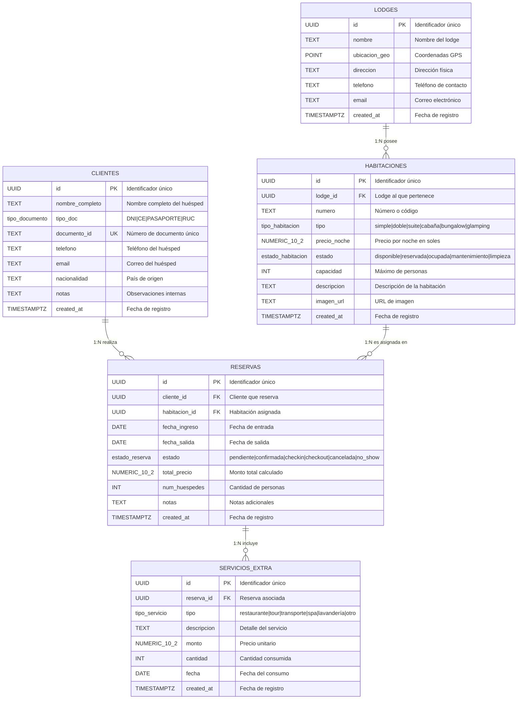

# 📐 Modelo Lógico de Base de Datos — SelvaStay Pro

**Sistema:** SelvaStay Pro — Gestión de Eco-Lodges  
**Motor:** PostgreSQL (via Supabase)  
**Versión:** 1.0  
**Autor:** Equipo SelvaStay  
**Fecha:** Mayo 2026  

---

## 1. Diagrama Entidad-Relación (ER)



---

## 2. Modelo Relacional (Notación Formal)

```
LODGES (id, nombre, ubicacion_geo, direccion, telefono, email, created_at)
  PK: id

HABITACIONES (id, lodge_id, numero, tipo, precio_noche, estado, capacidad, descripcion, imagen_url, created_at)
  PK: id
  FK: lodge_id → LODGES(id) ON DELETE CASCADE
  UK: (lodge_id, numero)

CLIENTES (id, nombre_completo, tipo_doc, documento_id, telefono, email, nacionalidad, notas, created_at)
  PK: id
  UK: documento_id

RESERVAS (id, cliente_id, habitacion_id, fecha_ingreso, fecha_salida, estado, total_precio, num_huespedes, notas, created_at)
  PK: id
  FK: cliente_id → CLIENTES(id) ON DELETE RESTRICT
  FK: habitacion_id → HABITACIONES(id) ON DELETE RESTRICT
  CHECK: fecha_salida > fecha_ingreso
  CHECK: total_precio >= 0
  CHECK: num_huespedes > 0

SERVICIOS_EXTRA (id, reserva_id, tipo, descripcion, monto, cantidad, fecha, created_at)
  PK: id
  FK: reserva_id → RESERVAS(id) ON DELETE CASCADE
  CHECK: monto >= 0
  CHECK: cantidad > 0
```

---

## 3. Diccionario de Datos

### 3.1 Tabla: `lodges`
> Almacena la información de cada eco-lodge o recreo turístico registrado en el sistema.

| Campo | Tipo | Restricción | Descripción |
|-------|------|-------------|-------------|
| `id` | UUID | PK, NOT NULL, DEFAULT uuid_generate_v4() | Identificador único del lodge |
| `nombre` | TEXT | NOT NULL | Nombre comercial del establecimiento |
| `ubicacion_geo` | POINT | NULLABLE | Coordenadas geográficas (latitud, longitud) |
| `direccion` | TEXT | NULLABLE | Dirección física del establecimiento |
| `telefono` | TEXT | NULLABLE | Número de teléfono de contacto |
| `email` | TEXT | NULLABLE | Correo electrónico del establecimiento |
| `created_at` | TIMESTAMPTZ | NOT NULL, DEFAULT now() | Fecha y hora de creación del registro |

---

### 3.2 Tabla: `habitaciones`
> Representa cada unidad de alojamiento dentro de un lodge. Incluye estado en tiempo real.

| Campo | Tipo | Restricción | Descripción |
|-------|------|-------------|-------------|
| `id` | UUID | PK, NOT NULL, DEFAULT uuid_generate_v4() | Identificador único de la habitación |
| `lodge_id` | UUID | FK → lodges(id), NOT NULL, ON DELETE CASCADE | Lodge al que pertenece |
| `numero` | TEXT | NOT NULL, UNIQUE(lodge_id, numero) | Número o código identificador dentro del lodge |
| `tipo` | ENUM `tipo_habitacion` | NOT NULL, DEFAULT 'simple' | Tipo: simple, doble, suite, cabaña, bungalow, glamping |
| `precio_noche` | NUMERIC(10,2) | NOT NULL, CHECK >= 0 | Precio por noche en soles (PEN) |
| `estado` | ENUM `estado_habitacion` | NOT NULL, DEFAULT 'disponible' | Estado actual: disponible, reservada, ocupada, mantenimiento, limpieza |
| `capacidad` | INT | NOT NULL, DEFAULT 2, CHECK > 0 | Capacidad máxima de personas |
| `descripcion` | TEXT | NULLABLE | Descripción detallada de la habitación |
| `imagen_url` | TEXT | NULLABLE | URL de la imagen principal |
| `created_at` | TIMESTAMPTZ | NOT NULL, DEFAULT now() | Fecha y hora de creación |

---

### 3.3 Tabla: `clientes`
> Registro de huéspedes y visitantes del sistema.

| Campo | Tipo | Restricción | Descripción |
|-------|------|-------------|-------------|
| `id` | UUID | PK, NOT NULL, DEFAULT uuid_generate_v4() | Identificador único del cliente |
| `nombre_completo` | TEXT | NOT NULL | Nombre completo del huésped |
| `tipo_doc` | ENUM `tipo_documento` | NOT NULL, DEFAULT 'DNI' | Tipo de documento: DNI, CE, PASAPORTE, RUC |
| `documento_id` | TEXT | NOT NULL, UNIQUE | Número de documento de identidad |
| `telefono` | TEXT | NULLABLE | Teléfono de contacto |
| `email` | TEXT | NULLABLE | Correo electrónico |
| `nacionalidad` | TEXT | DEFAULT 'Peruana' | País de origen del huésped |
| `notas` | TEXT | NULLABLE | Observaciones internas sobre el huésped |
| `created_at` | TIMESTAMPTZ | NOT NULL, DEFAULT now() | Fecha y hora de registro |

---

### 3.4 Tabla: `reservas`
> Controla las reservaciones de habitaciones con ciclo de vida completo.

| Campo | Tipo | Restricción | Descripción |
|-------|------|-------------|-------------|
| `id` | UUID | PK, NOT NULL, DEFAULT uuid_generate_v4() | Identificador único de la reserva |
| `cliente_id` | UUID | FK → clientes(id), NOT NULL, ON DELETE RESTRICT | Cliente titular de la reserva |
| `habitacion_id` | UUID | FK → habitaciones(id), NOT NULL, ON DELETE RESTRICT | Habitación asignada |
| `fecha_ingreso` | DATE | NOT NULL | Fecha de check-in |
| `fecha_salida` | DATE | NOT NULL, CHECK > fecha_ingreso | Fecha de check-out |
| `estado` | ENUM `estado_reserva` | NOT NULL, DEFAULT 'pendiente' | Estado: pendiente, confirmada, checkin, checkout, cancelada, no_show |
| `total_precio` | NUMERIC(10,2) | NOT NULL, DEFAULT 0, CHECK >= 0 | Monto total (noches + servicios). Calculado automáticamente por trigger |
| `num_huespedes` | INT | NOT NULL, DEFAULT 1, CHECK > 0 | Cantidad de personas |
| `notas` | TEXT | NULLABLE | Notas adicionales de la reserva |
| `created_at` | TIMESTAMPTZ | NOT NULL, DEFAULT now() | Fecha y hora de creación |

---

### 3.5 Tabla: `servicios_extra`
> Consumos y servicios adicionales vinculados a una reserva activa.

| Campo | Tipo | Restricción | Descripción |
|-------|------|-------------|-------------|
| `id` | UUID | PK, NOT NULL, DEFAULT uuid_generate_v4() | Identificador único del servicio |
| `reserva_id` | UUID | FK → reservas(id), NOT NULL, ON DELETE CASCADE | Reserva a la que se carga |
| `tipo` | ENUM `tipo_servicio` | NOT NULL, DEFAULT 'otro' | Categoría: restaurante, tour, transporte, spa, lavandería, otro |
| `descripcion` | TEXT | NOT NULL | Detalle del servicio consumido |
| `monto` | NUMERIC(10,2) | NOT NULL, CHECK >= 0 | Precio unitario en soles |
| `cantidad` | INT | NOT NULL, DEFAULT 1, CHECK > 0 | Cantidad consumida |
| `fecha` | DATE | NOT NULL, DEFAULT CURRENT_DATE | Fecha del consumo |
| `created_at` | TIMESTAMPTZ | NOT NULL, DEFAULT now() | Fecha y hora de registro |

---

## 4. Tipos Enumerados (ENUMs)

| ENUM | Valores | Usado en |
|------|---------|----------|
| `tipo_habitacion` | simple, doble, suite, cabaña, bungalow, glamping | habitaciones.tipo |
| `estado_habitacion` | disponible, reservada, ocupada, mantenimiento, limpieza | habitaciones.estado |
| `tipo_documento` | DNI, CE, PASAPORTE, RUC | clientes.tipo_doc |
| `estado_reserva` | pendiente, confirmada, checkin, checkout, cancelada, no_show | reservas.estado |
| `tipo_servicio` | restaurante, tour, transporte, spa, lavanderia, otro | servicios_extra.tipo |

---

## 5. Relaciones y Cardinalidades

| Relación | Cardinalidad | Descripción | Regla de eliminación |
|----------|-------------|-------------|---------------------|
| LODGES → HABITACIONES | 1:N | Un lodge tiene muchas habitaciones | CASCADE (al eliminar lodge, se eliminan sus habitaciones) |
| CLIENTES → RESERVAS | 1:N | Un cliente puede tener muchas reservas | RESTRICT (no se puede eliminar un cliente con reservas) |
| HABITACIONES → RESERVAS | 1:N | Una habitación puede estar en muchas reservas (no simultáneas) | RESTRICT (no se puede eliminar habitación con reservas) |
| RESERVAS → SERVICIOS_EXTRA | 1:N | Una reserva puede tener muchos servicios adicionales | CASCADE (al cancelar reserva, se eliminan los servicios) |

---

## 6. Reglas de Negocio (Triggers)

### 6.1 `trg_calcular_total`
- **Tabla:** `reservas` (BEFORE INSERT OR UPDATE)
- **Función:** `calcular_total_reserva()`
- **Lógica:** Calcula automáticamente `total_precio` = (precio_noche × noches) + suma de servicios extra

### 6.2 `trg_sync_habitacion`
- **Tabla:** `reservas` (AFTER UPDATE OF estado)
- **Función:** `sync_estado_habitacion()`
- **Lógica:**
  - Reserva → `checkin` → Habitación → `ocupada`
  - Reserva → `checkout` o `cancelada` → Habitación → `limpieza`
  - Reserva → `confirmada` → Habitación → `reservada`

---

## 7. Índices de Rendimiento

| Índice | Tabla | Columna(s) | Propósito |
|--------|-------|-----------|-----------|
| `idx_habitaciones_lodge` | habitaciones | lodge_id | Filtrar habitaciones por lodge |
| `idx_habitaciones_estado` | habitaciones | estado | Dashboard de ocupación |
| `idx_clientes_documento` | clientes | documento_id | Búsqueda rápida por documento |
| `idx_reservas_cliente` | reservas | cliente_id | Historial de reservas del cliente |
| `idx_reservas_habitacion` | reservas | habitacion_id | Reservas por habitación |
| `idx_reservas_fechas` | reservas | fecha_ingreso, fecha_salida | Consultas por rango de fechas |
| `idx_reservas_estado` | reservas | estado | Filtrar reservas activas |
| `idx_servicios_reserva` | servicios_extra | reserva_id | Servicios por reserva |

---

## 8. Seguridad (Row Level Security)

| Tabla | Rol `authenticated` | Rol `anon` |
|-------|---------------------|------------|
| lodges | SELECT, INSERT, UPDATE, DELETE | SELECT, INSERT, UPDATE, DELETE (modo demo) |
| habitaciones | SELECT, INSERT, UPDATE, DELETE | SELECT, INSERT, UPDATE, DELETE (modo demo) |
| clientes | SELECT, INSERT, UPDATE, DELETE | SELECT, INSERT, UPDATE, DELETE (modo demo) |
| reservas | SELECT, INSERT, UPDATE, DELETE | SELECT, INSERT, UPDATE, DELETE (modo demo) |
| servicios_extra | SELECT, INSERT, UPDATE, DELETE | SELECT, INSERT, UPDATE, DELETE (modo demo) |

> **Nota:** Las políticas `anon` son permisivas para desarrollo/demo. En producción se restringirán a solo lectura o se eliminarán.

---

## 9. Suscripciones en Tiempo Real

| Tabla | Realtime habilitado | Canal |
|-------|-------------------|-------|
| habitaciones | ✅ Sí | `habitaciones-realtime` |
| reservas | ✅ Sí | `reservas-realtime` |

> Permite que el dashboard de ocupación se actualice instantáneamente cuando otro usuario modifica una habitación o reserva desde otro dispositivo.
